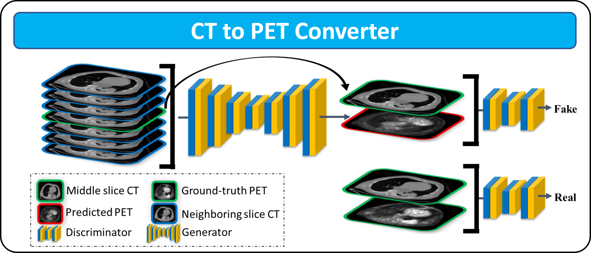

# Synthetic PET from CT


This is the code for following paper published in Cell Report Medicine (2024):

**Synthetic PET from CT improves diagnosis and prognosis for lung cancer: proof of concept** 


<div align=left></div>


## Train

After having the CT and PET data arrays (512x512x7) in the "/data_7CHL/pix2pix_7Ch7/trainA and trainB":

> python train.py --name 'name' --dataroot 'data_7CHL/pix2pix_7Ch7' --lr 0.0002 --lambda_L1 4000 --batch_size 4 --n_epochs 100 

Note: If necessary, specify the GPU to use by setting CUDA_VISIBLE_DEVICES=0, for example.

## Test
We uploaded the trained model which achieves the performance reported in the paper to the 'checkpoints' folder for your reference. 

To evaluate the trained model on one or several lung CT NIfTI files, execute the following command:

> python testNifty.py --dataroot '/Folder_with_lung_CT_Nifti_files_inside' --name 'checkpoints' --model 'pix2pix' --gpu_ids '0'  --mode 'test' --preprocess_gamma 1 --results_dir '/Result_folder'

After running the above code, a temp_folder is created in the /Folder_with_lung_CT_Nifti_files where the processed nifti file is divided to npy array of 512x512x7, and then the inference is called on them. The temporarily synthetic PET npy array are created in /Result_folder followed by its nifti_file.


## Links
The links to the datasets are:

MDA-TRAIN/TEST/SCREENING - N/A 

[TCIA-STANFORD](https://wiki.cancerimagingarchive.net/display/Public/NSCLC+Radiogenomics )

[LIDC-IDRI](https://wiki.cancerimagingarchive.net/pages/viewpage.action?pageId=1966254 )

[NSCLC-RT](https://www.cancerimagingarchive.net/ )

## Questionnaires

The questionnaires for tasks 1 and 2, as referenced in the "Imaging signal level validation by thoracic radiologists" section of our paper, can be accessed online via the following link:  [questionnaires](https://drive.google.com/drive/folders/13qlGhYc5jl9DrlINPmzAxxRiW8RYBFmW?usp=sharing). 

## Citation

If you find CC useful in your research, please consider citing:
```
@inproceedings{****,
  title={Synthetic PET from CT improves diagnosis and prognosis for lung cancer: proof of concept},
  author={****},
  booktitle={****},
  volume={****},
  number={****},
  pages={****},
  year={****}
}
```

## Acknowledgments
Code borrows heavily from [pix2pix](https://github.com/phillipi/pix2pix/tree/master). 

The Generator architecture was borrowed from [ResUNetPlusPlus](https://github.com/DebeshJha/ResUNetPlusPlus).


