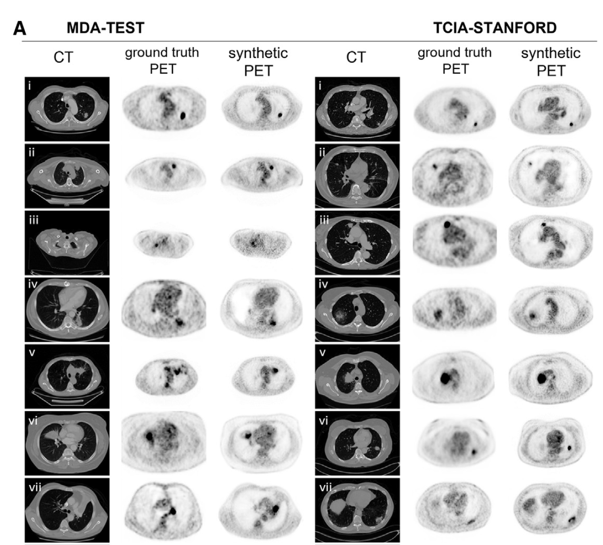

# 🏥 Synthetic PET from CT

[](https://www.cell.com/cell-reports-medicine)
[](https://www.python.org/)
[](https://pytorch.org/)

> **Synthetic PET from CT improves diagnosis and prognosis for lung cancer: proof of concept**  
> *Morteza Salehjahromi, et al.* - Cell Reports Medicine (2024)

This repository contains the implementation for generating synthetic Positron Emission Tomography (PET) scans from Computed Tomography (CT) images using deep learning techniques. The method demonstrates significant improvements in lung cancer diagnosis and prognosis.


## 📊 Overview

<div align="center">
  
</div>

## 🎯 Results

<div align="center">
  
  <p><em>Comparison of CT scans, ground truth PET, and synthetic PET across MDA-TEST and TCIA-STANFORD datasets</em></p>
</div>

## 🚀 Quick Start

### Prerequisites

- Python 3.7+
- PyTorch 1.0+
- CUDA (recommended for GPU acceleration)

### Installation

```bash
# Clone the repository
git clone <repository-url>
cd Synthetic-PET-from-CT

# Install dependencies (if using conda)
conda env create -f environment.yml
conda activate synthetic-pet

# Or install with pip
pip install -r requirements.txt
```

## 🏋️ Training

Prepare your data by placing CT and PET data arrays (512×512×7) in the following structure:
```
data_7CHL/
└── pix2pix_7Ch7/
    ├── trainA/  # CT scans
    └── trainB/  # PET scans
```

**Training Command:**
```bash
python train.py \
    --name 'experiment_name' \
    --dataroot 'data_7CHL/pix2pix_7Ch7' \
    --lr 0.0002 \
    --lambda_L1 4000 \
    --batch_size 4 \
    --n_epochs 100
```

> 💡 **Tip:** Specify GPU usage with `CUDA_VISIBLE_DEVICES=0` if needed

## 🔬 Testing & Inference

We provide a pre-trained model in the `checkpoints/` folder that achieves the performance reported in our paper.

### Testing on NIfTI Files

**Command:**
```bash
python testNifty.py \
    --dataroot '/path/to/lung_CT_Nifti_files' \
    --name 'checkpoints' \
    --mode 'test' \
    --preprocess_gamma 1 \
    --results_dir '/path/to/results'
```

**Process:**
1. A temporary folder is created in your input directory
2. NIfTI files are processed and divided into 512×512×7 numpy arrays
3. Inference is performed on each array
4. Synthetic PET arrays are generated and saved as NIfTI files in the results directory


## 📁 Datasets

| Dataset | Status | Link |
|---------|--------|------|
| **MDA-TRAIN/TEST/SCREENING** | Not Available | N/A |
| **TCIA-STANFORD** | Available | [NSCLC Radiogenomics](https://wiki.cancerimagingarchive.net/display/Public/NSCLC+Radiogenomics) |
| **LIDC-IDRI** | Available | [LIDC-IDRI](https://wiki.cancerimagingarchive.net/pages/viewpage.action?pageId=1966254) |
| **NSCLC-RT** | Available | [NSCLC-RT](https://www.cancerimagingarchive.net/) |

## 📋 Validation Questionnaires

For the "Imaging signal level validation by thoracic radiologists" section of our paper, we provide questionnaires for tasks 1 and 2:

🔗 **[Access Questionnaires](https://drive.google.com/drive/folders/13qlGhYc5jl9DrlINPmzAxxRiW8RYBFmW?usp=sharing)** 

## 📚 Citation

If you find this work useful in your research, please consider citing:

```bibtex
@article{salehjahromi2024synthetic,
  title={Synthetic PET from CT improves diagnosis and prognosis for lung cancer: proof of concept},
  author={Salehjahromi, Morteza and others},
  journal={Cell Reports Medicine},
  year={2024}
}
```

## 🙏 Acknowledgments

- Code heavily based on [pix2pix](https://github.com/phillipi/pix2pix/tree/master)
- Generator architecture adapted from [ResUNetPlusPlus](https://github.com/DebeshJha/ResUNetPlusPlus)
- Medical imaging community for datasets and validation

---

<div align="center">
  <p><strong>🏥 Advancing Medical AI for Better Patient Outcomes</strong></p>
</div>


